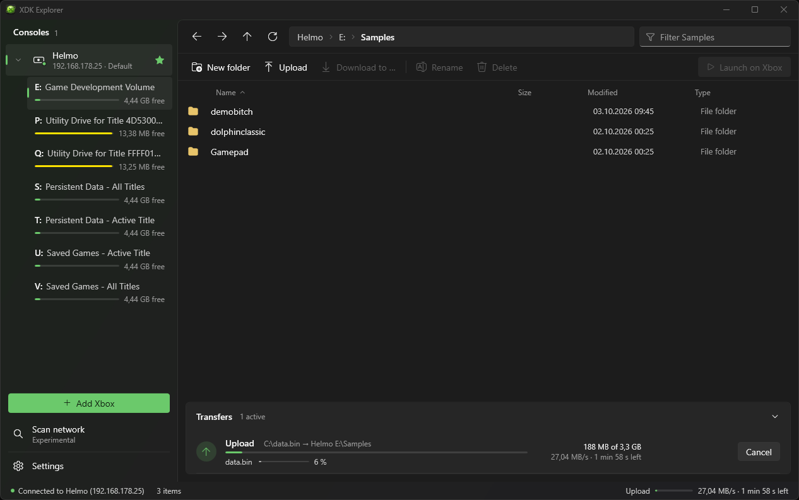

# XDK Explorer
<p align="center">
  
</p>

A standalone console manager and file browser for the original Xbox (2001) development kits.

The XDK includes Xbox Neighborhood, but its 32-bit Explorer extension is no longer supported by modern 64-bit Windows.
XDK Explorer is a standalone alternative that works alongside the XDK tools.

XDK Explorer talks to the consoles through `xboxdbg.dll` from the installed XDK, so it works with everything that runs
the Xbox Debug Monitor (XBDM): devkits, debug kits and xemu with a debug BIOS.

## Features

- **File transfers that just work.** Upload and download files and whole folders, with progress, speed and remaining
  time, cancel at any time and a choice to replace or skip existing files. Large files up to the 4 GB FATX limit
  go through reliably, and browsing the console stays responsive while a transfer runs.
- Browse drives, create folders, rename, delete and launch an `.xbe` on the console
- Manage consoles: add them by name or IP, find them with a network scan, set the default console.
  The list and the default are shared with the Xbox Neighborhood, Visual Studio .NET 2003 and the XDK tools.
- Remote console control through the XDK debug API: reboot, screenshots, clock sync and more.

## Requirements

- Windows (developed and tested on Windows 11)
- The original Xbox XDK installed (tested with 5849), XDK Explorer finds `xboxdbg.dll` through the XDK's registry
  entry or a folder you pick on first start

Each release comes in two downloads:

- `XdkExplorer-x.y.z.zip`: a single small exe, needs the [.NET 10 Desktop Runtime](https://dotnet.microsoft.com/download/dotnet/10.0)
  in the **x86** version. `xboxdbg.dll` is 32-bit, so XDK Explorer runs as a 32-bit process.
- `XdkExplorer-x.y.z-standalone.zip`: a single exe with the runtime included, runs without installing anything
  (larger in size and starts a little slower).

## Diagnostics

```
XdkExplorer.exe --diagnose [size in MB] [console name or IP]
```

Checks the connection and file transfers to a console (default console if none is given): name, address, drives,
upload and download of a random test file compared by SHA256, and a cancelled upload. The test writes to
`E:\XdkExplorerTest` on the console and deletes it again. Output goes to the terminal and to
`%APPDATA%\XdkExplorer\diagnose.log`.

## Building

```
dotnet build
```

WPF, .NET 10, CommunityToolkit.Mvvm. The project targets x86 because of `xboxdbg.dll`.


## Preview

<p align="center">
  
</p>
